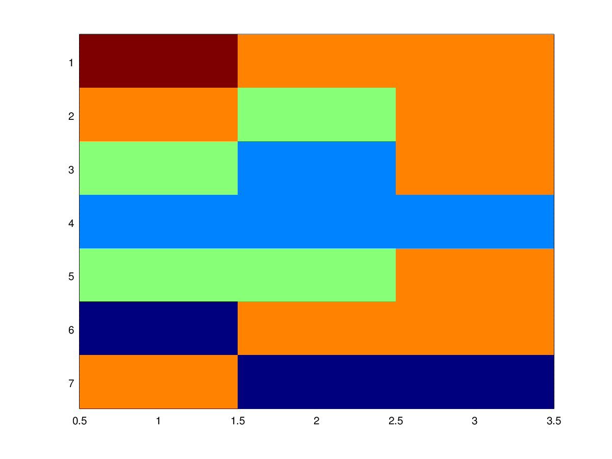

# Psudo code of utilities


## Length and index of the longest sequence of `x` element in the array:
This algorithm returns the index of the first element if the element is unique
in the array.
```js

// init
max_len = 0
last_eq =false
seq_start = 0
current_len = 0
iteration = 0
/* For each element in array */
foreach ( e in array) {
  current_len++
  if (max_len < current_len)
  {
    seq_start = iteration
    max_len = current_len
    if(last_eq)
    {
        seq_start = iteration - max_len + 1
    }
    last_eq = true
  }
  else {
    current_len = 0
    last_eq = false
  }

}
return seq_start, max_len
```

## Circular shift of an array
shift the array k places

| shift `k` | direction     |
| :------------- | :------------- |
| `<0`       | shift to the left       |
| `>0`       | shift to the right       |

```js

if(k == 0){return;}
/* Temporal space for shifted elements */
tmp = allocate(k * sizeof(element))

if (k > 0) {
  /*shift to the right*/
  memcpy(tmp, pArray+lenOfArray-shift, shift)
  memcpy(pArray+shift,pArray,lenOfArray-shift)
  memcpy(pArray, tmp,shift)
} else {
  /* shift to the left */
  memcpy(tmp, pArray, shift)
  memcpy(pArray,pArray+shift,lenOfArray-shift)
  memcpy(pArray+lenOfArray-shift, tmp,shift)
}
delete tmp
```


Intw:

1.
A call log is given with the next format:

```
hh:mm:ss,nnn-nnn-nnn
hh:mm:ss,nnn-nnn-nnn
hh:mm:ss,nnn-nnn-nnn
hh:mm:ss,nnn-nnn-nnn
```

We want to verify the cost of the complete bill. There are some rules:
- If the call is less than 5 min the cost per second is 3 cents.
- If the call is 5 min or more the cost per initiated minute is 150 cents.
  This means that a call if 00:05:01 = 6 min * 150c
- At the end of the period, the most recent number is selected and the cost of all the calls made to that number is removed.
  - If there are two numbers with the same amount of time, the one with the lowest numeric value is selected.

2.
An array of numbers of different color is given.
The array is of size NxM
Each color represents a country if two conditions are met:
- It's possible to move from one cell to another of the same color moving only to the nort, south, east or west.
- if it's not possible then its a different country even if they have the same color:


This algorithm must run in O(NxM) time and space
```matlab
C= [5,4,4;4,3,4;3,2,4;2,2,2;3,3,4;1,4,4;4,1,1]
imagesc(C)
# the answer for this is 11
```


3. Find the convex hull of a set of points in O(n log n) time.


4. Find the error in the `period.cpp` file, the file returns the length of the longest
periodic series in an `int`
