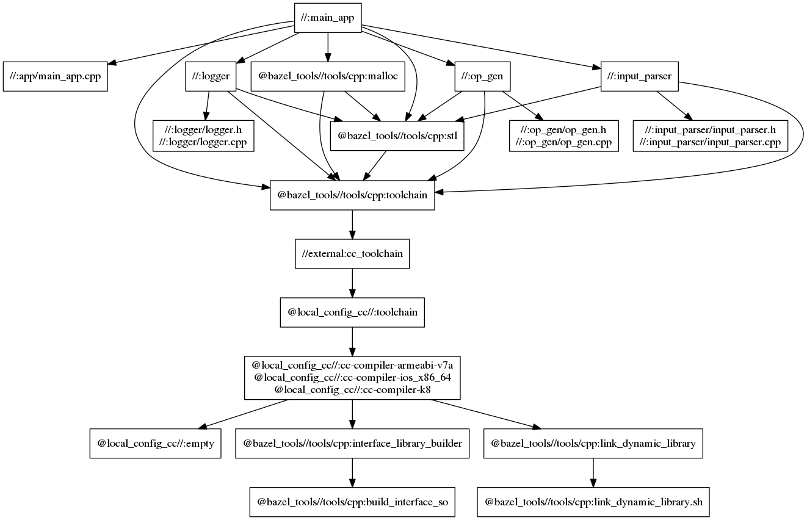
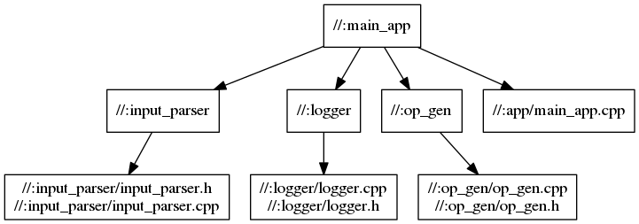

# Bazel Graph

bazel is able to create a visualization of the dependencies in the workspace.

```sh
bazel query 'deps(//:main_app)' --output graph > graph.in
```

To interpret the `graph.in` we need the `graphviz` programm.

```sh
dot -Tpng < graph.in > graph.png
```

The  result for this repo is the following:




However this displays dependencies that are not part of the project itself, to
fix this issue, add the flag `--noimplicit_deps` to obtain a simplified graph.

```sh
bazel query --noimplicit_deps 'deps(//:main_app)' --output graph > simple_graph.in
dot -Tpng < simple_graph.in > simple_graph.png
```

