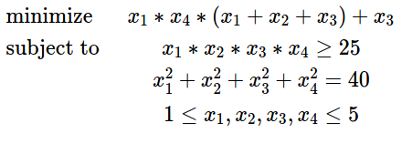

# Nonlinear programming using CppAD and Ipopt:

# Example and test

This example program demostrated how to use [ipopt solve](https://www.coin-or.org/CppAD/Doc/ipopt_solve.htm) to solve the next
example problem:
- - -

- - -
